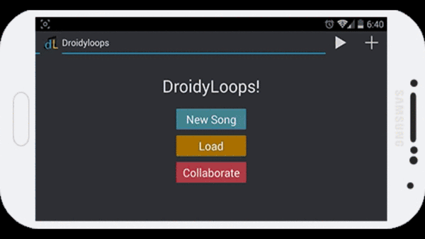
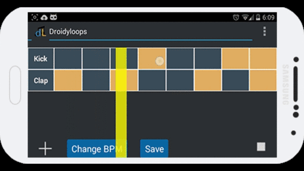
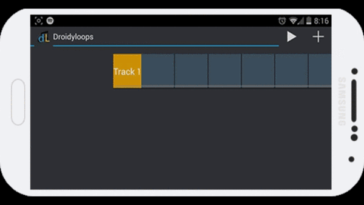

DroidyLoops
===========

DroidyLoops is an app where the idea is to collaboratively compose music by recording your own sounds 
and layering them to create songs.

### Users can:
* Record audio from their voice, instrument or any sound desired and the app 
will save it as a track. 
* The user can add and layer tracks as desired (as memory permits); These track layers can be moved around or deleted.

### Future plans
* Users will be able to allow the public or certain users to collaborate on a song. Future plans will include a portal of “top” samples that people can add on to it. 
* Users will then be able to export songs and use it in any way they want.
  
   
   
   

#### Supports a virtually infinite number of customisable tracks

#### Make loops on the fly

#### Record your voice or environmental sounds, and add it to your song.
